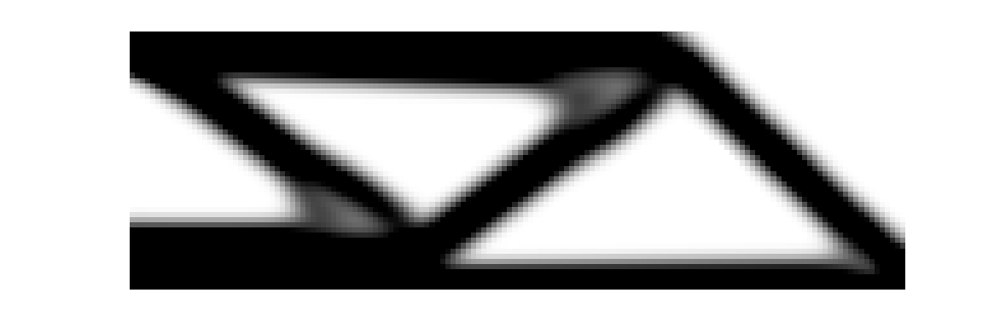

# FEMAT — Finite Element Analysis in MATLAB

[](https://github.com/xwpken/femat/stargazers) [](https://github.com/xwpken/femat/fork) [](https://github.com/xwpken/femat/blob/main/LICENSE) [](https://github.com/xwpken/femat/issues)


**FEMAT** is a compact finite element library implementing 2D/3D linear elasticity and geometric nonlinear (TL) static analysis, with both MATLAB and Python interfaces. The codebase was initially developed during my master's studies for the research on topology optimization. Now it has been refactored to be modular and extensible, allowing users to easily add new material models, element types, and analysis capabilities.

---

## Features

| Category | Capabilities |
|:---|---|
| **Analysis** | `small_strain` (linear elasticity), `finite_strain` (geometric nonlinearity) |
| **Constitutive** | `linear_elastic` (plane stress / plane strain / 3D), `hyperelastic` (SVK, Neo-Hookean) |
| **Elements** | `QUAD4`, `TRI3` (2D); `HEX8`, `TET4` (3D) |
| **Interface** | MATLAB (CLI) + Python package (`pyfemat`) |

---

## Installation

Clone the repository:

```bash
git clone https://github.com/xwpken/femat.git
cd femat
```

### MATLAB

Run the setup script to add the project to the MATLAB path:

```matlab
>> setup
```

### Python

```bash
pip install matlabengine           # MATLAB Engine API
pip install -e .                   # install pyfemat (editable mode)
```

Please ensure that you have MATLAB installed and properly configured to use the MATLAB Engine API for Python. Refer to the [MATLAB documentation](https://www.mathworks.com/help/matlab/matlab_external/install-the-matlab-engine-for-python.html) for detailed instructions.

---

## Quick start

### MATLAB

```matlab
>> setup
>> cd examples/beam
>> example
```

### Python

```python
import pyfemat

mesh = pyfemat.QuadMesh(8.0, 1.0, 32, 4)
model = pyfemat.Model(mesh)
model.material("hyperelastic", model="neo_hookean", E=1, nu=0.3)
model.fix([1, 3, 5, 2, 4, 6])
model.force([54, 52, 50], [-0.0025, -0.005, -0.0025])
model.analysis("finite_strain")

sol = model.solve()
print(sol.dofs.reshape(-1, 2))
```

---

## Examples

### Cantilever beam

<p align="center">
  <br>
  Deformed configuration of a neo-hookean beam under end traction.
</p>

### Topology optimization

<p align="center">
  <br>
  Optimized topology of the MBB beam.
</p>

---

## Python API

```python
mesh  = pyfemat.QuadMesh(Lx, Ly, nx, ny)         # create mesh
model = pyfemat.Model(mesh)                       # build model

model.material("linear_elastic", stress_state="plane_strain", E=1, nu=0.3)
model.material("hyperelastic", model="svk", E=1, nu=0.3)

model.set("Mat.Emin", 1e-9)                       # set arbitrary field
model.get("eDof")                                 # get arbitrary field
model.get_ke(ele_idx=1)                           # element tangent stiffness
model.save_vtk("output.vtk", sol)                 # VTK export

model.fix([1, 3, 5])                              # Dirichlet BC
model.force([2], [-1.0])                          # Neumann BC
model.analysis("finite_strain")                   # select analysis
sol = model.solve()                               # solve (Newton-Raphson)

solution.dofs                                      # displacement vector
```

---

## Citation
If you find this library useful in your research, please consider citing it as follows:
```bibtex
@misc{femat_github,
  author       = {Weipeng Xu},
  title        = {femat},
  year         = {2026},
  publisher    = {GitHub},
  journal      = {GitHub repository},
  howpublished = {\url{https://github.com/xwpken/femat}}
}
```
